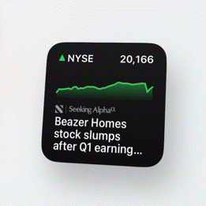
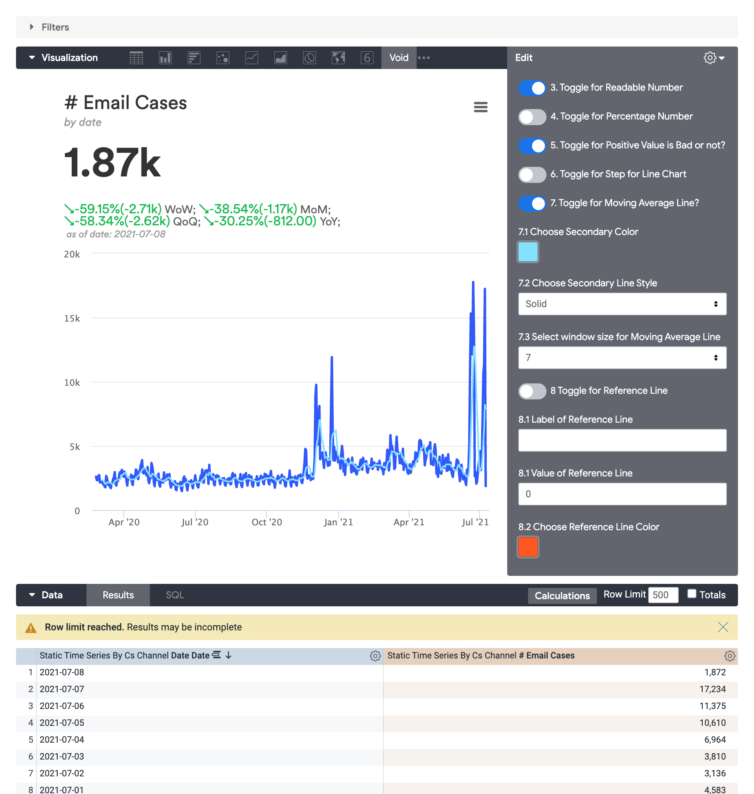

# Metric as a Widget
a highcharts implementation of custom visualization in Looker

Please refer to this blog post for more details: [Metric as a Widget | Klyn's Space🪐](https://klynwuuxyz.montaigne.io/thoughts-from-work/metric-as-a-widget)

# How to Load into Looker
1. load `main.js` into Looker admin portal
> `main.js` is for rendering the widget
2. load `util.js` into Looker admin portal as dependency
> `util.js` is for data transformation

